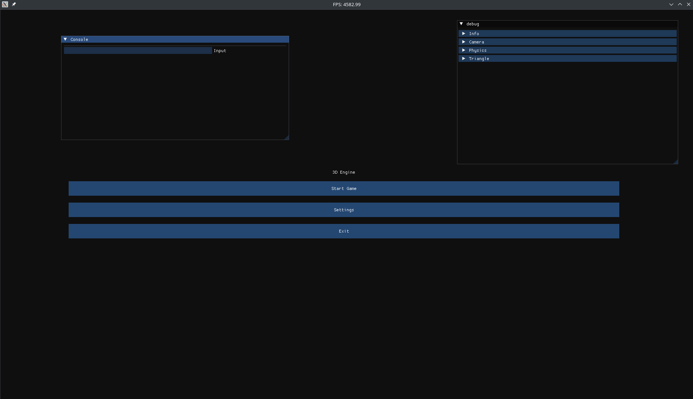
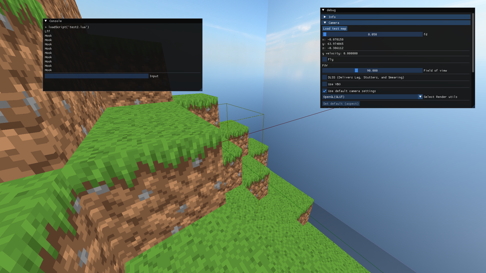
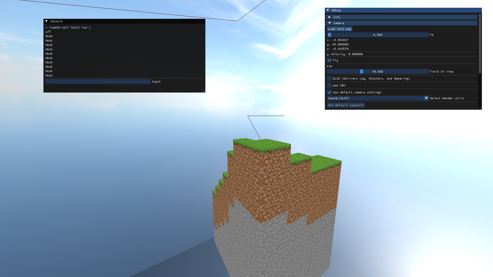

# 3D-движок на SFML + C++

# Версия: 0.1 beta

## Быстрая навигация
- [Описание](#Описание)
- [Статус разработки](#Статус-разработки)
- [Планы](#Планы)
- [Devlog](#Devlog)
    - [Версия 0.1 beta](#Версия-0-1-devlog)
    - [Версия 0.004.1](#Версия-0-004-1-devlog)
    - [Версия 0.004](#Версия-0-004-devlog)
    - [Версия 0.003](#Версия-0-003-devlog)
    - [Версия < 0.003](#Версия-<-0-003-devlog)
- [Скриншоты](#Скриншоты)
    - [Версия 0.1](#Версия-0-1-скриншоты)
    - [Версия 0.004.1](#Версия-0-004-1-скриншоты)
    - [Версия 0.004](#Версия-0-004-скриншоты)
    - [Версия 0.003](#Версия-0-003-скриншоты)
- [Запуск движка](#Запуск)


## Описание
Движок находится в стадии разработки. Используется SFML для рендеринга и управления окнами.

## Статус разработки
- [x] Отрисовка граней
- [x] Работа с эвентами
- [x] Управление
- [x] Работа с шейдерами OpenGL
- [x] Работа с ImGui
- [X] Работа с перспективой
- [x] Отрисовка спрайтов
- [x] Базовое управление камерой
- [x] Загрузка текстур
- [X] Объекты и коллизии
- [X] Оптимизация рендера
- [X] Оптимизация вычислений
- [X] Поддержка карт уровней
- [X] Простая физика
- [X] LUA-скрипты

## Планы
Нету


## Devlog
### Версия 0-1 devlog
**Что нового?**
- Добавлена **Оптимизация**, которая оптимизирует рендер и физику.
- Добавлены **Баги**, чтобы не расслаблялись!.
Реализована **Поддержка LUA**, которая добавляет возможность модинга.
Да-да, теперь вы можете модить игру с помощью Lua-скриптов!
Пишите свои моды, скрипты и баги - и делитесь ими с друзьями.
**Пример кода на LUA**:
```lua
-- --PLAYER
local mx = Game.Player:getCamera().x
local my = Game.Player:getCamera().y
-- Player pos
local x = Game.Player:getPos().x
local y = Game.Player:getPos().y
local z = Game.Player:getPos().z
-- Render data
local fov = Game.Render:getCamera().FOV
-- functions
Game.Player.teleport(x, y, z, mx, my)

-- --RENDER
-- functions
Game.Render.drawLine(x, y, z, 0, 0, 0, 1, 0, 0)
if false then
    Game.Render.clearBufferLines()
    print("Buffer clear")
end

-- --CHAT
-- functions
Game.Chat.send("Hello, LUA!")
if false then
    Game.Chat.clear()
    print("Chat clear")
end

-- -- -- log
print("Player MX:", mx)
print("Player MY:", my)
print("Player X:", x)
print("Player Y:", y)
print("Player Z:", z)
print("Render FOV:", fov)

Game.Engine.loadScript("debug/hitbox.lua")
Game.Engine.loadLocalScript("print('Hi')")

-- Game.Server.sv_loadMap("testmap")
```


- Из за перехода на **новую систему хранения карт** не работает генерация.

Я знаю, я работаю над этим. Наверное.

- **И многое другое :cookie:**.
### Версия 0-004-2 devlog
**Что нового?**
- Добавлена **Оптимизация**, которая увеличивает FPS в 10934 раз :Cookie:.
### Версия 0-004-1 devlog
**Что нового?**  
- Удален **FrameDeGenerator**, который снижает FPS в 10 раз :cry:.
### Версия 0-004 devlog
**Что нового?**  
- Добавлена **обработка мыши**, теперь можно взаимодействовать с камерой.  
- Реализована **работа со спрайтами**, поддерживаются 2D-изображения.   
- Добавлено **текстурирование**, теперь объекты могут иметь текстуры, а не просто цвета.  
- По умолчанию включен **FrameDeGenerator**, который снижает FPS в 10 раз :sunglasses:.
### Версия 0-003 devlog
**Что нового?**  
- Добавлена **поддержка 3D** с использованием OpenGL! Теперь все стало объемным.  
- Добавлен **крутящийся куб**, который впечатляюще вертится в пространстве :sunglasses:.  
### Версия < 0-003 devlog
**Что нового?**  
- Добавлены **события (events)** для обработки пользовательского ввода.  
- Реализованы **окна**, теперь можно открывать и управлять ими.  
- Добавлены **простые 2D-фигуры** (линии, прямоугольники, круги и т. д.).  

## Скриншоты
### Версия 0-1 скриншоты



### Версия 0-004-1 скриншоты

### Версия 0-004 скриншоты


### Версия 0-003 скриншоты


## Запуск
1. Установите SFML3.
1. Установите GLEW.
1. Установите GLUT.
2. Скопируйте репозиторий:
```sh
git clone https://github.com/Alex9600t/3d-engine
```
3. Скомпилируйте проект:
```sh
make
```
> [!NOTE]
> Игра запускается сразу после компиляции.

> [!WARNING]
> В некоторых случаях управление может не работать. 
> Решение:
> Перезапустите игру:
> ```sh
> ./start
> ```
> Если это не помогло, напишите в Issues.