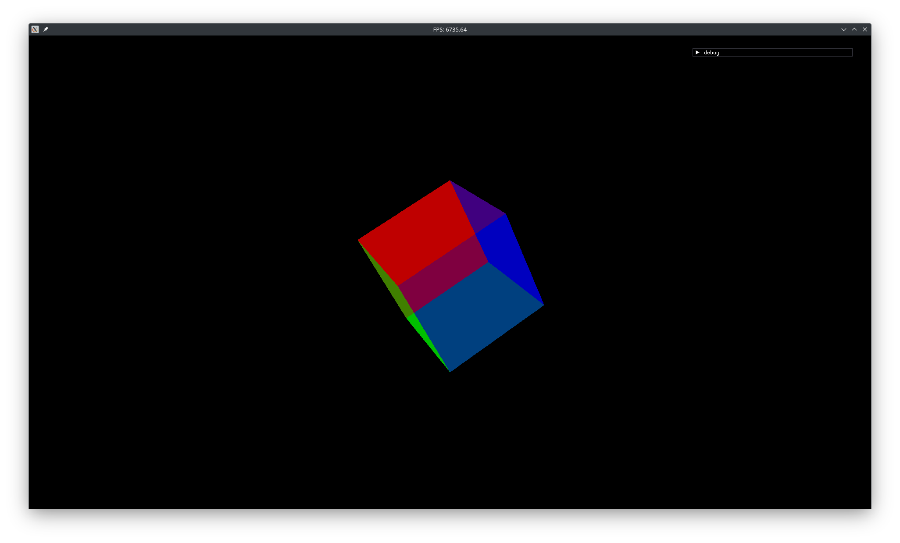
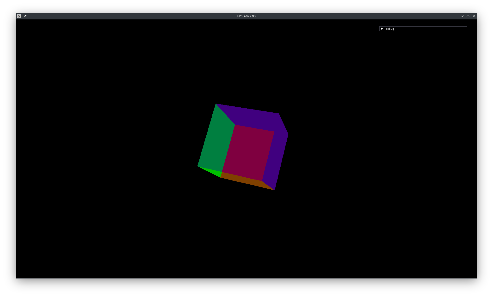

# 3D-движок на SFML + C++

## Быстрая навигация
- [Описание](#Описание)
- [Статус разработки](#Статус-разработки)
- [Планы](#Планы)
- [Скриншоты](#Скриншоты)
- [Запуск движка](#Запуск)
- [Планы](#Планы)
- [Планы](#Планы)
- [Планы](#Планы)


## Описание
Движок находится в стадии разработки. Используется SFML для рендеринга и управления окнами.

## Статус разработки
- [x] Отрисовка граней
- [x] Работа с эвентами
- [x] Управление
- [x] Работа с шейдерами OpenGL
- [x] Работа с ImGui
- [X] Работа с перспективой
- [ ] Отрисовка спрайтов
- [ ] Базовое управление камерой
- [ ] Загрузка текстур
- [ ] Объекты и коллизии

## Планы
- [ ] Добавить поддержку карт уровней
- [ ] Реализовать простую физику

## Скриншоты



## Запуск
1. Установите SFML3.
1. Установите GLUT.
2. Скопируйте репозиторий:
```sh
git clone https://github.com/Alex9600t/3d-engine
```
3. Скомпилируйте проект:
```sh
make
```
> [!NOTE]
> Игра запускается сразу после компиляции.

> [!WARNING]
> В некоторых случаях управление может не работать. 
> Решение:
> Перезапустите игру:
> ```sh
> ./start
> ```
> Если это не помогло, напишите в Issues.