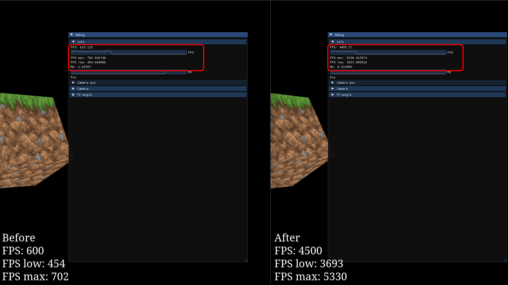

# 3D-движок на SFML + C++

# Версия: 0.003

## Быстрая навигация
- [Описание](#Описание)
- [Статус разработки](#Статус-разработки)
- [Планы](#Планы)
- [Devlog](#Devlog)
    - [Версия 0.004.1](#Версия-0-004-1-devlog)
    - [Версия 0.004](#Версия-0-004-devlog)
    - [Версия 0.003](#Версия-0-003-devlog)
    - [Версия < 0.003](#Версия-<-0-003-devlog)
- [Скриншоты](#Скриншоты)
    - [Версия 0.004.1](#Версия-0-004-1-скриншоты)
    - [Версия 0.004](#Версия-0-004-скриншоты)
    - [Версия 0.003](#Версия-0-003-скриншоты)
- [Запуск движка](#Запуск)


## Описание
Движок находится в стадии разработки. Используется SFML для рендеринга и управления окнами.

## Статус разработки
- [x] Отрисовка граней
- [x] Работа с эвентами
- [x] Управление
- [x] Работа с шейдерами OpenGL
- [x] Работа с ImGui
- [X] Работа с перспективой
- [x] Отрисовка спрайтов
- [x] Базовое управление камерой
- [x] Загрузка текстур
- [ ] Объекты и коллизии
- [ ] Оптимизация рендера
- [ ] Оптимизация вычислений

## Планы
- [ ] Добавить поддержку карт уровней
- [ ] Реализовать простую физику

## Devlog
### Версия 0-004-1 devlog
**Что нового?**  
- Удален **FrameDeGenerator**, который снижает FPS в 10 раз :cry:.
### Версия 0-004 devlog
**Что нового?**  
- Добавлена **обработка мыши**, теперь можно взаимодействовать с камерой.  
- Реализована **работа со спрайтами**, поддерживаются 2D-изображения.   
- Добавлено **текстурирование**, теперь объекты могут иметь текстуры, а не просто цвета.  
- По умолчанию включен **FrameDeGenerator**, который снижает FPS в 10 раз :sunglasses:.
### Версия 0-003 devlog
**Что нового?**  
- Добавлена **поддержка 3D** с использованием OpenGL! Теперь все стало объемным.  
- Добавлен **крутящийся куб**, который впечатляюще вертится в пространстве :sunglasses:.  
### Версия < 0-003 devlog
**Что нового?**  
- Добавлены **события (events)** для обработки пользовательского ввода.  
- Реализованы **окна**, теперь можно открывать и управлять ими.  
- Добавлены **простые 2D-фигуры** (линии, прямоугольники, круги и т. д.).  

## Скриншоты
### Версия 0-004-1 скриншоты

### Версия 0-004 скриншоты


### Версия 0-003 скриншоты


## Запуск
1. Установите SFML3.
1. Установите GLUT.
2. Скопируйте репозиторий:
```sh
git clone https://github.com/Alex9600t/3d-engine
```
3. Скомпилируйте проект:
```sh
make
```
> [!NOTE]
> Игра запускается сразу после компиляции.

> [!WARNING]
> В некоторых случаях управление может не работать. 
> Решение:
> Перезапустите игру:
> ```sh
> ./start
> ```
> Если это не помогло, напишите в Issues.